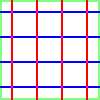
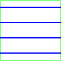
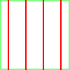

# Mousepad pattern generate for Mouse System mice

https://github.com/xunker/mouse_system_mousepad_generator

Generates nice color-coded grid patterns so you can use your Mouse Systems (Sun, SGI, etc) optical
mice without having to find one of those special mouse pads.

## Requirements

* Ruby version 2.5 or greater
* A printer, preferably colour

## Installation

Assuming ruby is installed on your system, download the code, and in a terminal screen:

```sh
$ cd mouse_system_mousepad_generator # or wherever you downloaded it
$ bundle install
```

## Usage

```
Unless otherwise specified, all dimensional measurements are in PIXELS.

Usage: ./mousepad_generator.rb [options]
-v, --[no-]verbose               Run verbosely (default: false)
-b, --[no-]border                Add border to image output (default: true)
-o, --output=FILENAME            Filename (or filename mask) to write (default: "mousepad.png")
-H, --horizontal-color=RGBA      Color of horizontal lines in 'rrggbbaa' hex (default: "0000ffff")
-V, --vertical-color=RGBA        Color of vertical lines in 'rrggbbaa' hex (default: "ff0000ff")
-I, --intersection-color=RGBA    Color where lines intersect in 'rrggbbaa' hex (default: "ff00ffff")
-B, --border-color=RGBA          Color of border in 'rrggbbaa' hex (default: "00ff0080")
-w, --width=WIDTH                Width in pixels (default: 1024)
-h, --height=HEIGHT              Height in pixels (default: 768)
-l, --line-thickness=PIXELS      Line thickness in pixels (default: 2)
-p, --pitch=PIXELS               Pitch of the grid lines in pixels (default: 10)
-s, --[no-]separate-files        Generate separate files for horizontal and vertical lines (default: false)
```

## Output

### Single File

By default, both the horizontal and vertical lines are written to the same file and will output
something like this:



### Separate Files

Some mice might not like having the red and blue lines overlap on the same page, so if you are
printing on transparency film you also have the option (`--separate-files`) to generate two images
with only the horizontal or vertical lines so you can stack or laminate them.




